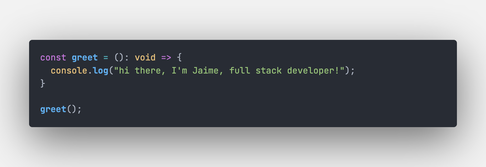

<h2>Welcome to my GitHub 🖖</h2>

<h4 align="center">👋 Welcome! My name is Jaime, I'm a software engineer specialized in Javascript technologies based in Madrid. Love trying out new fields and facing different challenges, always keen to dive into new technologies.</h4>
 

<h3>Tech Stack</h3>

  

 

🔭 I’m currently working on adding new features and polishing HomeQuest 
🌱 I’m currently learning more about Salesforce 
🧑‍💻 In case you want to know more about me, please check out my <a href="https://www.linkedin.com/in/jaimemastretta/">LinkedIn</a> profile 
📫 Feel free to reach out anytime at jaimemastretta@gmail.com

